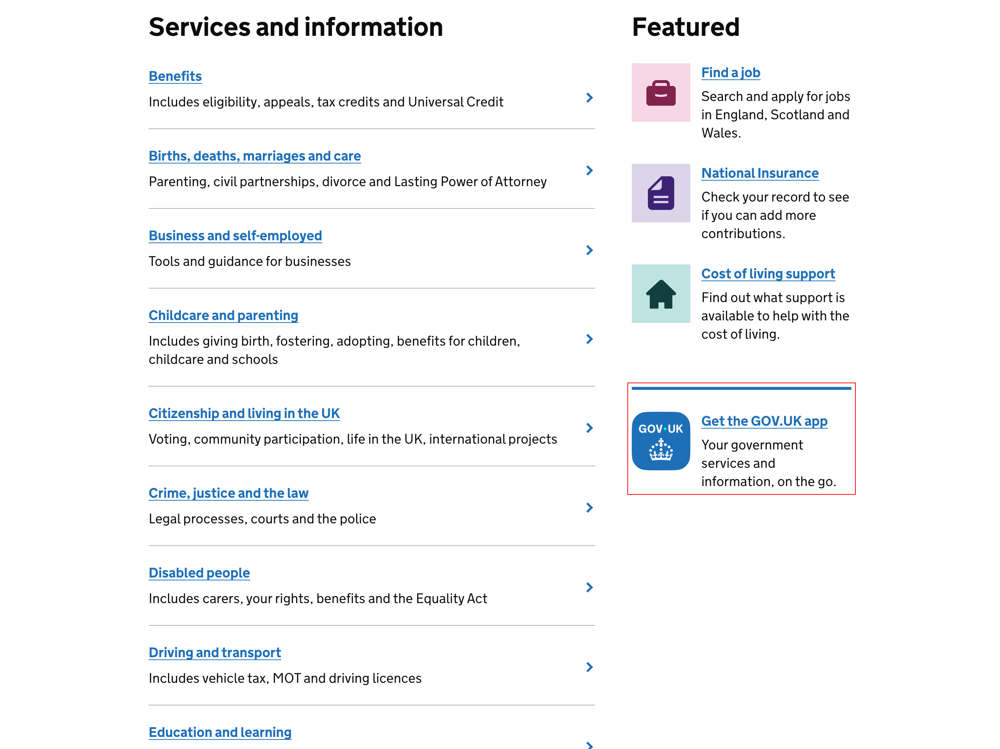

# Managing the GOV.UK App promo featured section on the homepage

The GOV.UK App promo section appears on the homepage below the featured promotion slots. It is used to highlight the GOV.UK App and drive traffic to the [Download the GOV.UK app](https://www.gov.uk/guidance/download-the-govuk-app) detailed guide page.



## To remove the promo

Delete the following YAML entries:

```diff
- promotion_slots_secondary:
- - text: Your government services and information, on the go.
-   title: Get the GOV.UK app
-   href: "/guidance/download-the-govuk-app"
-   image_src: app-promo/govuk-app-icon.png
```

## To re-enable the promo

You can restore the promo by either:
- reverting the changes in the PR that removed the YAML entries.
- Manually adding the YAML keys back, like this:

```diff
+ promotion_slots_secondary:
+ - text: Your government services and information, on the go.
+   title: Get the GOV.UK app
+   href: "/guidance/download-the-govuk-app"
+   image_src: app-promo/govuk-app-icon.png
```

## More information

For details on when and how the promo was added to the homepage, see [Add app promo to homepage #5058
](https://github.com/alphagov/frontend/pull/5058).
